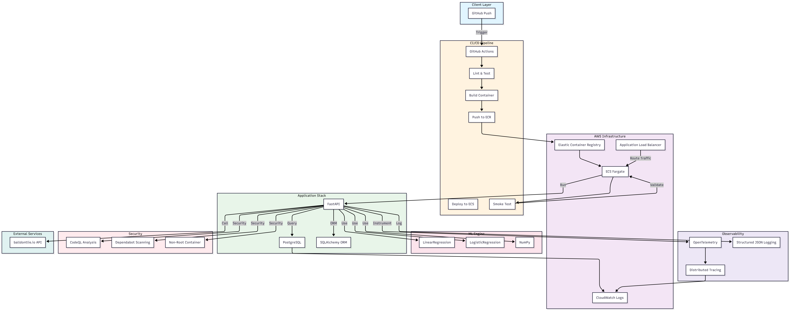
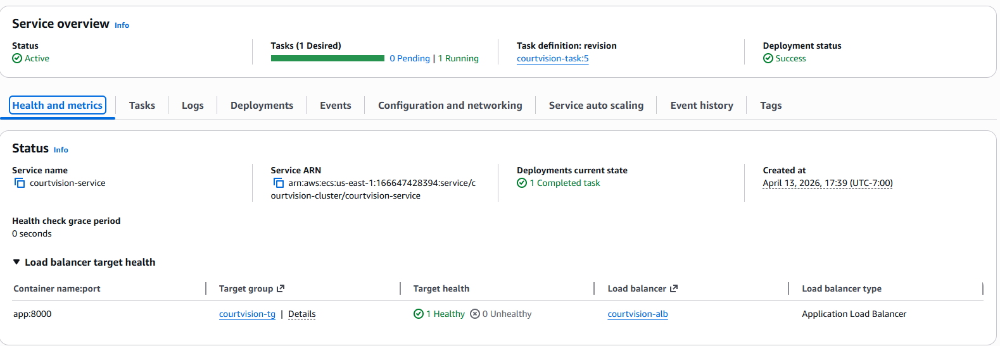

# CourtVision API

A basketball statistics microservice wrapping the [balldontlie.io](https://www.balldontlie.io) API, built to demonstrate end-to-end DevOps and platform engineering practices.

Built with **FastAPI**, persisted in **PostgreSQL**, containerized with **Docker**, provisioned with **Terraform**, and deployed to **AWS ECS Fargate** via a **GitHub Actions CI/CD pipeline**.

---

## Tech Stack

| Layer | Tools |
|---|---|
| Backend | Python, FastAPI, Pydantic v2 |
| Database | PostgreSQL, SQLAlchemy (async) |
| ML | scikit-learn (LinearRegression, LogisticRegression), NumPy |
| Observability | OpenTelemetry, structured JSON logging |
| Infrastructure | Terraform, AWS ECS/Fargate, ALB, ECR, SSM |
| CI/CD | GitHub Actions |
| Containerization | Docker |
| Monitoring | AWS CloudWatch, OpenTelemetry traces |
| Security | CodeQL, Dependabot, non-root Docker container |

---

## API Endpoints

| Route | Method | Description |
|---|---|---|
| `/health` | GET | Service heartbeat |
| `/players/search?name=` | GET | Search players by name — results persisted to DB |
| `/players/{player_id}/season-averages?season=` | GET | Season averages for a player — results persisted to DB |
| `/compare?player1=&player2=&season=` | GET | Compare two players' season stats side by side |
| `/ingest/{season}` | POST | Bulk ingest all games and player stats for a season |
| `/predict/player?player_id=&opponent_team_id=` | GET | Predict pts/ast/reb for a player against an opponent |
| `/predict/game?home_team_id=&away_team_id=` | GET | Predict win probability for a home vs away matchup |

---

## ML Predictions

After ingesting at least one season's worth of data via `POST /ingest/{season}`, the prediction endpoints become available.

### `GET /predict/player`

Fits a **LinearRegression** model on a player's full game log history using three features:

| Feature | Description |
|---|---|
| `is_home` | 1 if the player's team was home, 0 if away |
| `is_vs_opponent` | 1 if the game was against the specified opponent |
| `game_index` | Chronological position in the player's game log (trend proxy) |

Returns predicted `pts`, `ast`, `reb` for the next game along with R² scores and sample size. Requires ≥10 valid (non-DNP) game logs.

### `GET /predict/game`

Fits a **LogisticRegression** model on historical game results for both teams using three features:

| Feature | Description |
|---|---|
| `is_home_team_home` | 1 if the home team played at home in that game |
| `is_matchup` | 1 if that game was a direct head-to-head between the two teams |
| `home_score_diff` | Point differential (home score − visitor score) |

Returns `home_win_probability` (0–1), average points per team, and head-to-head record. Requires ≥20 combined games across both teams.

---

## Local Development

### Prerequisites
- Docker Desktop
- A [balldontlie.io](https://www.balldontlie.io) API key

### Setup

1. Copy the example env file and fill in your API key:
   ```bash
   cp .env_example .env
   # edit .env and set BALLDONTLIE_API_KEY
   ```

2. Start the API and database:
   ```bash
   docker compose up --build
   ```

3. The API is available at `http://localhost:8000`. Interactive docs at `http://localhost:8000/docs`.

### Running tests

```bash
pip install -r requirements.txt
pytest --cov=app -v
```

---

## Architecture



Infrastructure is provisioned via Terraform under `terraform/`. See `terraform/terraform.tfvars` for required input variables before applying.

---

## Observability

**Structured logging** — All log output is JSON with ISO 8601 timestamps, log level, logger name, message, and a `request_id` correlation field. Every inbound request is assigned a unique ID (or reuses the caller's `X-Request-ID` header) that propagates through all log lines for that request. Logs ship to CloudWatch via the ECS awslogs driver.

**Distributed tracing** — OpenTelemetry auto-instruments FastAPI (inbound requests), httpx (outbound API calls to balldontlie.io), and SQLAlchemy (database queries). ML prediction endpoints add custom spans for model training and inference steps. Traces export via OTLP to any compatible collector (AWS ADOT, Jaeger, Grafana Tempo). Set `OTEL_EXPORTER_OTLP_ENDPOINT` to enable export; set `OTEL_TRACES_CONSOLE=true` for local dev.

**Dependency scanning** — Dependabot monitors Python packages, GitHub Actions, Terraform providers, and Docker base images for security vulnerabilities and outdated versions. CodeQL performs static analysis on every push and PR, plus a weekly scheduled scan.

## Deployment

The service runs on AWS ECS Fargate behind an Application Load Balancer. Infrastructure is provisioned via Terraform and deployed automatically via the GitHub Actions CD pipeline.


